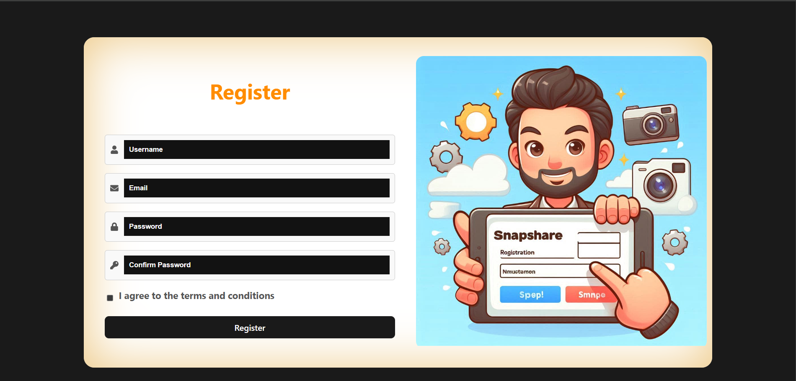
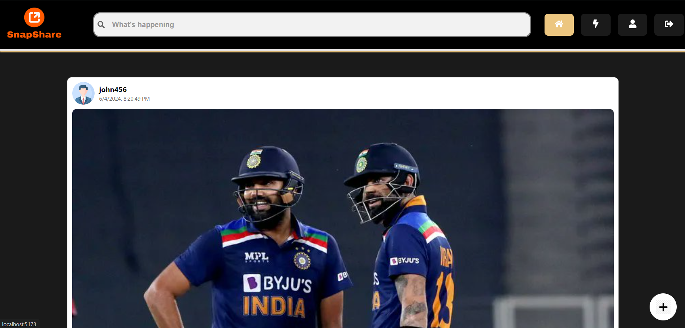
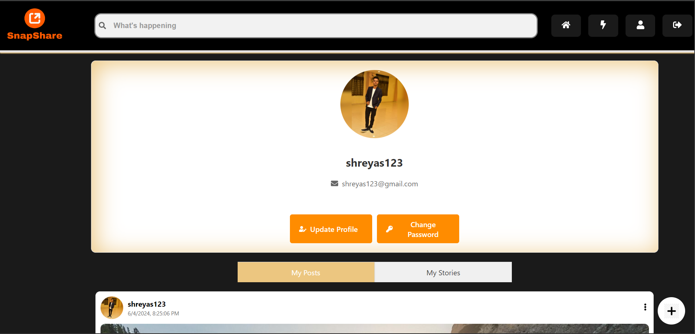
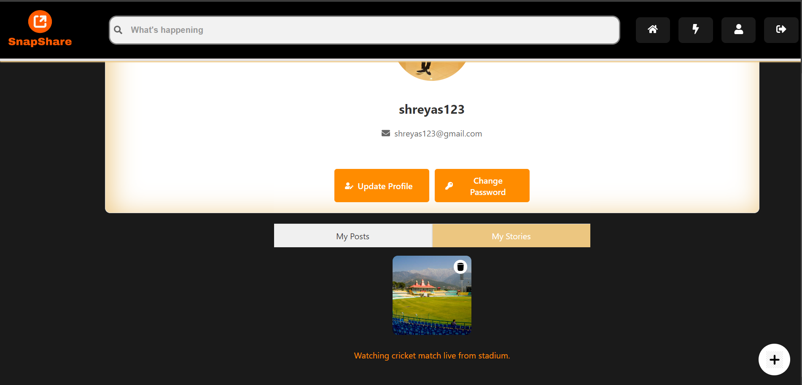
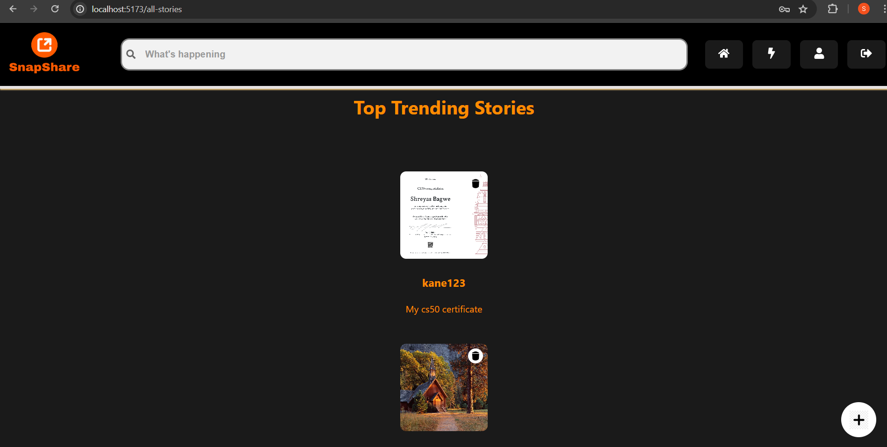
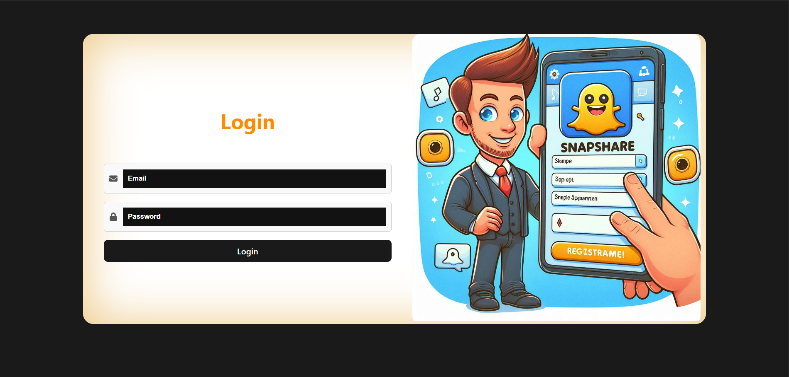
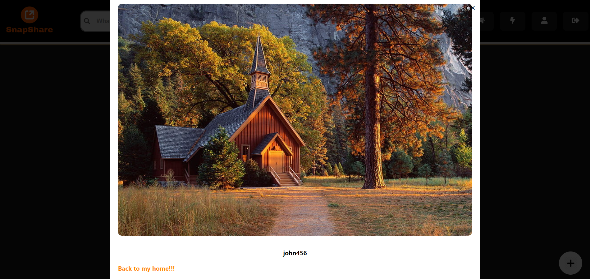
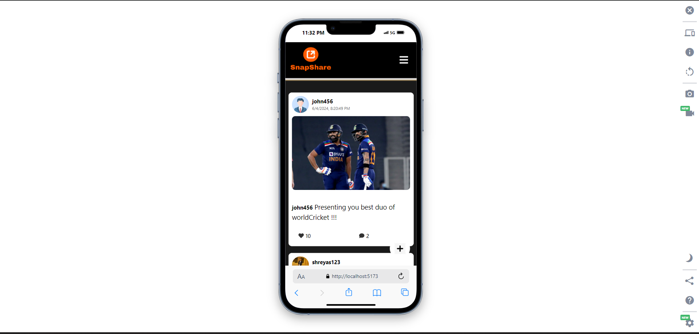
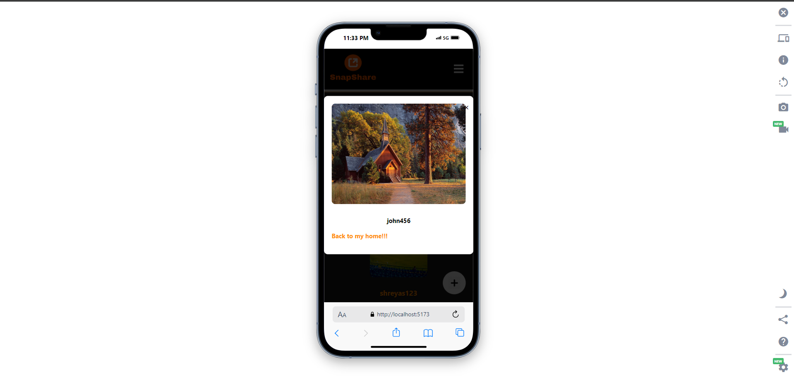

# SnapShare

SnapShare is a lightweight social media app built with the MERN stack (MongoDB, Express.js, React, and Node.js). This app allows users to post stories, share posts with friends, and connect with others in a simple, intuitive interface.

Demo Video Link:https://youtu.be/BDb8ggYGT9Q

## Features

- Upload post and view other's post.
- Post stories  and share updates
- User authentication and profile management.
- Image uploads with Cloudinary integration.
- Responsive design for seamless use on any device.

## ScreenShots

## Conclusion

Creating SnapShare was an incredible journey that significantly boosted my learning curve. Throughout the development process, I encountered numerous bugs and challenges, especially related to cookies, Cloudinary, and state management. Sometimes, it took an entire day to solve even a minor bug. However, every problem had a solution, and with persistence and determination, I eventually resolved each issue. This project has not only enhanced my technical skills but also taught me the importance of perseverance and problem-solving in software development. 

